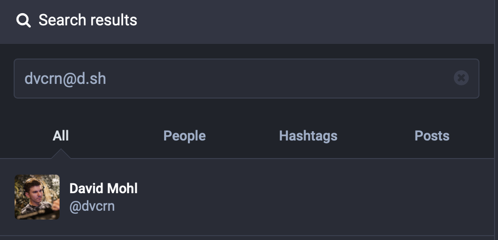
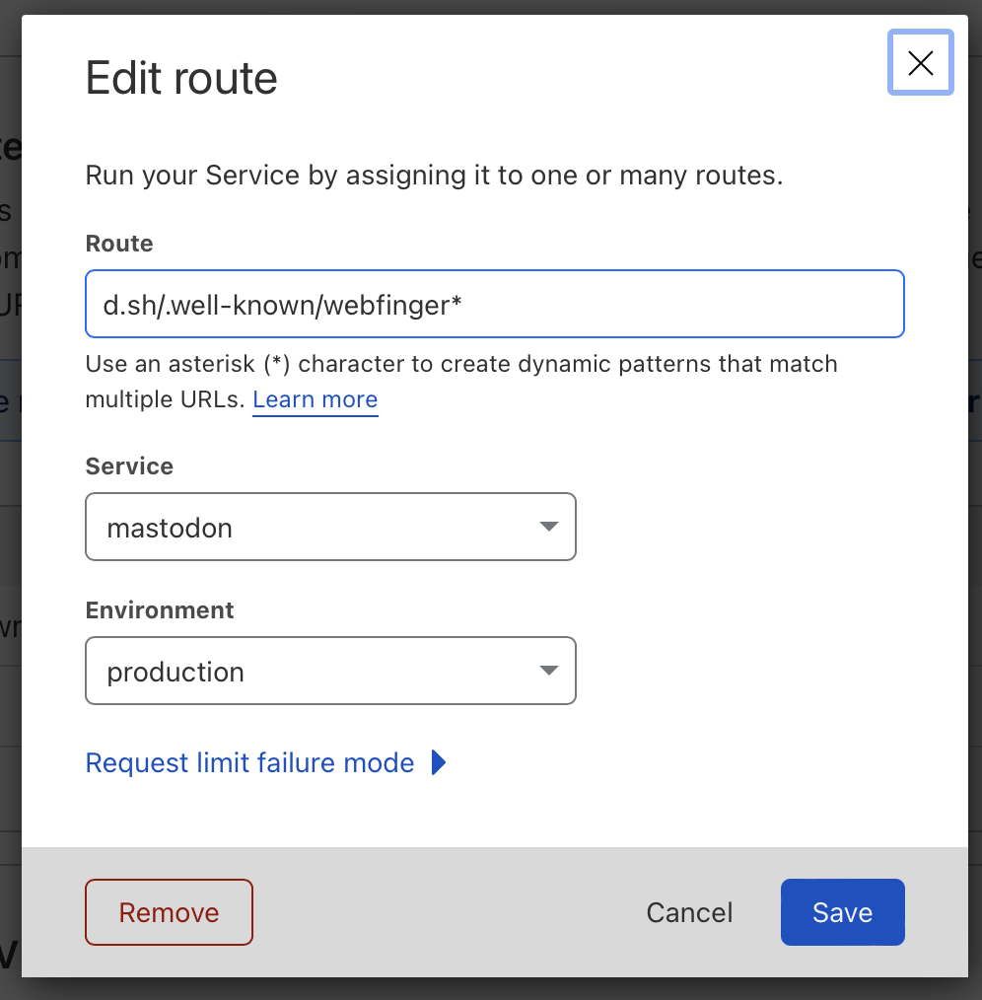

# Mastodon custom domain alias on Cloudflare workers

Mini script to quickly add support for setting `you@yourdomain.com` as search alias to your main mastodon profile, running on Cloudflare workers



## Config & Deploy

Copy the content of index.js into a new Cloudflare worker or run `wrangler publish`

The first line configures the account redirects:

```js
const accountConfig = {
  "dvcrn@d.sh": "dvcrn@mas.to",
};
```

This will resolve search queries for `dvcrn@d.sh` (assuming the worker is running on d.sh) to return account information for `dvcrn@mas.to`

Then go to Cloudflare and set a new URL for your worker like so:



## License

MIT